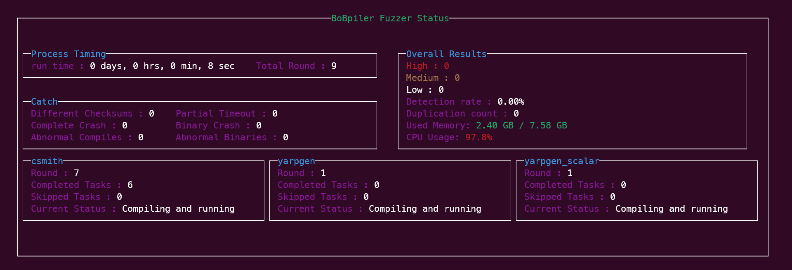

# BoBpiler-fuzzer

BoBpiler-fuzzer는 Windows 및 Linux 환경 모두에서 사용 가능한 범용 퍼저입니다. 이 도구는 다양한 아키텍처와 컴파일러를 지원하며, 복잡한 코드 생성을 위한 여러 코드 생성기를 포함하고 있습니다.

### Fuzzer Display



**지원 OS 및 환경**
- Ubuntu 22.04.2 LTS (WSL2, Native)
- Windows 11 Pro
    - x64 Native Tools Command Prompt for VS 2022
    - arm64 Native Tools Command Prompt for VS 2022

**지원 컴파일러**
- Windows:
    - `MSVC CL`, `Mingw`, `LLVM-mingw` (x86_64)
    - `MSVC CL`, `MSVC clang-cl` (arm64)
- Linux:
    - `GCC`, `LLVM` (다양한 아키텍처 지원)
        - Arm64 (little)
        - Risc-v64 (little)
        - X86-64 (little)
        - Mips64 (big)
        - Mips64el (little)
        - Powerpc64le (little)
        - Powerpc64 (big)
        - S390x (big)
        - Sparc64 (big)
    - `emcc`, `wasienv` 
        - wasmer
        - wasmtime
        - node
        - wasirun

**코드 생성 제너레이터**
- `Csmith`
- `Yarpgen`
- `Yarpgen_Scalar`

**추가 기능**
- `MacOS (x86_64)`에서의 `Mach-O` 바이너리 생성 및 실행 지원(by `Osxcross` and `Darling`)


## Telegram Notification Setup

알림을 받기 위해서는 텔레그램 봇 설정이 필요합니다.

### Steps:
1. **Get your Bot Token**: Telegram's BotFather를 통해 봇을 생성하고 토큰을 획득합니다.
2. **Find your Chat ID**: 텔레그램 봇에 메시지를 보내고 `/getUpdates` API 메서드를 사용하여 Chat ID를 찾습니다.
3. **Edit `config.py`**: 프로젝트 폴더에서 `conf.py` 파일을 열고, `TOKEN`과 `CHAT_ID` 변수에 획득한 Bot Token과 Chat ID를 할당합니다.

## 사용법

### 1. 필수 설치

```bash
sudo ./install.sh
```

```sh
c:\{REPO}> INST_DEPS.bat 
```


Linux - `install.sh` 스크립트를 실행하면 필요한 모든 설정과 파일들이 자동으로 설치되며, `선택`을 통해서 원하는 것만 설치가 가능합니다.

Window - `INST_DEPS.bat` 배치 파일을 실행하면 필요한 설치가 이루어집니다. 

### 2. 퍼저 실행
**실행 방법**

**Linux 환경:**
```bash
python3 fuzzer.py
```
**Windows 환경:**
```bash
python fuzzer.py
```
**옵션 설명**
1. `--no-timeout`:

이 옵션을 사용하여 퍼저를 실행하면, partial_timeout을 무시합니다.

예시:
```bash
python3 fuzzer.py --no-timeout
```
2. `--endian`:

이 옵션은 아키텍처의 엔디언 타입을 지정합니다. big 또는 little 값 중 하나를 선택할 수 있습니다.

- big: 빅 엔디안 아키텍처에 대해서 퍼저를 실행합니다.
```bash
python3 fuzzer.py --endian big
```

- little: 리틀 엔디안 아키텍처에 대해서 퍼저를 실행합니다.
```bash
python3 fuzzer.py --endian little
```
3. `No option`:

옵션을 지정하지 않고 퍼저를 실행하면, 기본적으로 partial_timeout을 탐지하며 리틀엔디안 아키텍처에 대해서 퍼저를 실행합니다.


## 3. 결과 저장 구조

`output` 폴더 내부에서는 각 생성기(yarpgen, csmith 등) 별로 서브폴더가 생성됩니다. 각 서브폴더 안에는 `catch`와 `temp` 두 개의 폴더가 있습니다.

- **temp**: 작업 중인 데이터가 저장됩니다.
- **catch**: 버그를 포착한 경우 해당 데이터가 저장됩니다.

각 `catch`와 `temp` 폴더 내부에는 소스 코드의 UUID를 이름으로 하는 폴더가 생성되고, 그 안에는 다음과 같은 파일들이 저장됩니다:

- 소스 코드 파일
- 컴파일된 바이너리 파일들
- 결과를 정리한 .txt와 .json 파일

### 예시 트리 구조는 다음과 같습니다.

```bash
.
├── **yarpgen**
│   ├── **temp**  (작업 중인 데이터 저장)
│   │   └── {UUID}
│   │       ├── init.h
│   │       ├── func.c
│   │       └── driver.c
│   └── **catch**  (버그를 포착한 데이터 저장)
│       ├── partial_timeout
│       │   └── {UUID}
│       │       ├── ... (GCC, Clang 등 다양한 컴파일러 결과)
│       │       ├── {UUID}_result.txt
│       │       └── {UUID}_result.json
│       └── abnormal_compile
│           └── {UUID}
│               ├── ... (GCC, Clang 등 다양한 컴파일러 결과)
│               ├── {UUID}_result.txt
│               └── {UUID}_result.json
└── **csmith**
    ├── **temp**  (작업 중인 데이터 저장)
    │   └── {UUID}
    │       └── random_program_{UUID}.c
    └── **catch**  (버그를 포착한 데이터 저장)
        └── {UUID}
            ├── ... (GCC, Clang 등 다양한 컴파일러 결과)
            ├── {UUID}_result.txt
            └── {UUID}_result.json
```

## 4. 특이사항
1. 타임아웃: 현재 생성기 10초, 컴파일 30초, 바이너리 10초로 설정했습니다. config.py에서 timeout을 조절할 수 있습니다.  
2. output 폴더에 생성기 별로 결과가 담겨있으며, 연 월 일 시를 기준으로 이름이 생성되고 **동일한 폴더가 있다면 삭제하고 만들기 때문에 주의해야 합니다.**
3. config.py에서 generators, compilers 부분을 수정해서 특정 부분만 실행할 수 있습니다. 추후에 옵션을 줄 수 있도록 해보겠습니다.  
4. 현재 config.py에 있는 설정으로 돌리면 CPU 자원과 메모리 사용이 극심하기 때문에 테스트 하고 싶은 옵션으로 설정해주고 실행하는 것이 좋을 것 같습니다. (컴파일러 종류, 옵션 등...)
